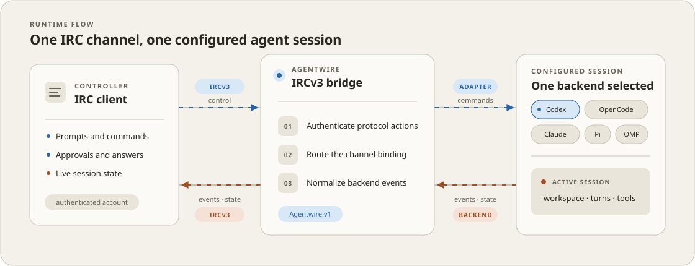

# Agentwire

Agentwire exposes live Codex, OpenCode, Claude, Pi, and OMP sessions as a structured agent harness over IRCv3. A
supporting client renders sessions, turns, plans, tool cards, approvals, questions, queues, usage,
and history while the channel remains a useful readable transcript.



The canonical protocol is [`docs/agentwire-irc-v1.md`](docs/agentwire-irc-v1.md). Its JSON Schema
and interoperability fixtures live in [`protocol/`](protocol/). The old `!command` chat interface
has been removed; all control messages now use the authenticated protocol tag.

## Development

Enter the pinned Nix environment through direnv or explicitly:

```console
nix develop
```

Run the checks with:

```console
nix develop -c sh -c 'ruff format --check src tests && ruff check src tests && pytest -q'
```

The same flake supplies the development environment, checks, package, and deployment commands.

## Configuration and startup

Copy [`config.example.toml`](config.example.toml) to a private location and create its mode-0600
secrets env file. The state path is a private SQLite database containing bindings, action
deduplication, event history, and prompt queues.
On first use of an old JSON state path, Agentwire imports its bindings and preserves the original
as a mode-0600 `.legacy-json` backup.

The foreground stack starts the SSH tunnel and bridge. It starts Codex and OpenCode servers only
when channels use those backends. Claude needs no server here: when a Claude-backed
channel is configured, the bridge starts one `claude` CLI subprocess per session through the
Claude Agent SDK and stops it with the session. Because there is no shared Claude server, live
session discovery only sees sessions this bridge is running; `agentwire doctor` verifies the
`claude` binary and its credentials (`claude auth status`, or the configured `api_key_env`).

pi likewise needs no server: a running pi TUI serves a local socket through its Agentwire
extension (see [`docs/pi-socket.md`](docs/pi-socket.md)), which the bridge discovers and drives
live, and sessions nobody is running are created or resumed by a bridge-owned `pi --mode rpc`
subprocess speaking the same protocol. Live TUI sessions answer their own extension dialogs in
the terminal; only bridge-spawned sessions relay dialogs as Agentwire questions and approvals.
A missing `pi` binary warns at stack startup instead of stopping other backends;
creating Pi sessions still requires it.
Optional `[pi].dedicated_channels = true` creates each new Pi session in a private, ephemeral
`#pi-<short-id>` channel. Channels survive IRC reconnects but not a bridge process restart; Pi's
JSONL session remains resumable. Closing stops only its bridge-owned RPC process; static channels
and live TUIs are never stopped.

OMP uses the same static/live split under the distinct `omp` backend: its extension serves live
TUI sockets in `$XDG_RUNTIME_DIR/agentwire/omp`, while bridge-owned sessions run `omp --mode rpc`.
Optional `[omp].dedicated_channels = true` creates private `#omp-<short-id>` channels with the
same lifecycle as Pi's dedicated channels. See [`docs/pi-socket.md`](docs/pi-socket.md).

```console
nix run .#stack
```

The bridge requires TLS, SASL, account tags, message tags, server time, batches, echo-message
support, labeled responses, standard replies, multiline messages, chat history, and event playback.
It does not enable echo-message on its own connection because receiving its published traffic would
only duplicate work. Configure Ergo 2.19.0 or newer with persistent SQLite history, a 30-day channel
retention period, stored `TAGMSG` values for `+trevarj.github.io/agentwire`, and no fakelag for the
Agentwire bot. On a shared server, use a dedicated oper class whose only capability is `nofakelag`;
never grant the bot general operator privileges.

Set a channel topic to activate the harness only after testing:

```text
agentwire:v1;account=your-account;agent=bot-account;backend=codex | Project title
```

The three parameters answer three different questions. `backend` picks the engine (`codex`,
`opencode`, `claude`, `pi`, or `omp`) and must match what
[`config.example.toml`](config.example.toml) assigns to that channel. `account` and `agent` are IRC
account names, never engine names: `account` is
the controller allowed to issue actions, and `agent` is the bot account whose messages clients
trust as backend state. `agent=claude` would mean an IRC account literally named "claude" — the
engine is chosen only by `backend`. The single-account form is:

```text
agentwire:v1;account=agentwire;agent=agentwire;backend=claude | Project title
```

Both accounts come from the IRCv3 `account` tag, not the nickname, and `agent` must be the
bridge's own account (its configured nickname). Running one SASL account for both — separating
projects by channel — is supported: set `account` and `agent` to the same name and make
`owner_account` match the bridge nickname. Separate accounts remain the safer split, since one
shared credential can both publish state and issue owner commands. Removing the prefix suspends
the harness and pauses queue dispatch without canceling active backend work.

### Voice notes and PM control

The optional `[voice]` table in [`config.example.toml`](config.example.toml) enables
workstation transcription of motd voice notes. Notes must be unencrypted OGG or MP4,
at most 15 minutes and 25 MiB, with the canonical audio tag and an HTTPS upload URL.
Only the authenticated owner can submit them in an activated channel with a bound
session. Playback is ignored; retries use the normal durable action receipts.
The Nix apps provide FFmpeg and Whisper; configure a verified Whisper model file
and check availability with `agentwire doctor --json`.

The optional `[pm]` table maps project names to static worker channels and one
coordinator channel. Its Unix socket trusts other same-user coding processes:
use a real, user-owned mode-0700 parent directory; the socket itself is mode 0600.
Workers do not need the private Agentwire configuration or IRC credentials:

```console
agentwire delegate --socket ~/Workspace/.agentwire/control.sock \
  --project touch-hockey --task TH-0001 --text 'Report the project name without changing files.'
agentwire report --socket ~/Workspace/.agentwire/control.sock \
  --project touch-hockey --task TH-0001 --status done --text 'The project name is touch-hockey.'
```

Success prints the accepted action UUID, not task completion. A lost response means
the outcome is unknown: reconcile target-channel receipts before manually retrying.
Raw socket clients must write one LF-terminated JSON request and half-close their
write side before reading the response; the CLI handles this framing. Delegation
can only target configured projects, and reports only target the coordinator.

Tool approvals are automatic by default for the active, bound sessions in the
configured PM coordinator and project channels. Questions, inactive sessions,
and unrelated channels remain manual; sandbox restrictions are unchanged.
Use `nix run .#stack -- --manual-approval` (or `agentwire run --manual-approval`)
to require manual tool approval in PM channels too. Failed automatic approvals
remain available for manual review rather than being reported as resolved.

## Reference client

The dependency-free reference library is `agentwire.reference_client`. Its JSONL CLI lets mobile
client development validate topic parsing, fragments, actions, and render state without embedding
Agentwire:

```console
nix develop -c sh -c 'PYTHONPATH=src python -m agentwire.reference_client'
```

Example input:

```json
{"op":"topic","topic":"agentwire:v1;account=trev;agent=agentwire;backend=codex | Test"}
{"op":"ingest","tag":"{\"at\":1785400000000,...}"}
{"op":"action","kind":"sync.request"}
{"op":"state"}
```

Each output is one minified JSON object. An `action` response contains the exact `PRIVMSG` or
`TAGMSG` sequence and tag values the IRC layer should send.

## Privacy model

Workspace paths resolve beneath configured roots. Sensitive question text is never relayed and is
answerable only in an attached TUI, though it may be skipped from IRC. Tool events contain only
safe structured metadata. If a high-confidence secret detector matches an assistant message, the
entire message is omitted from IRC. There is no wire override and no external paste service.
